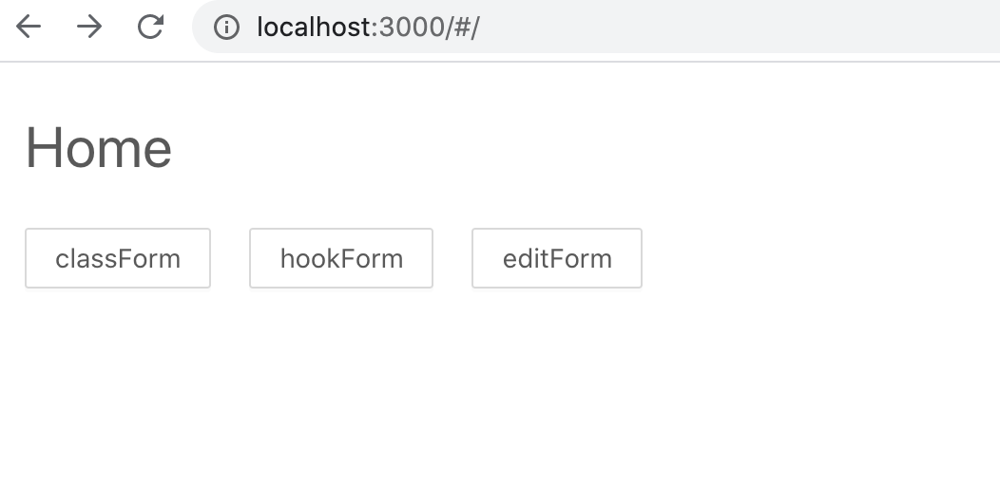
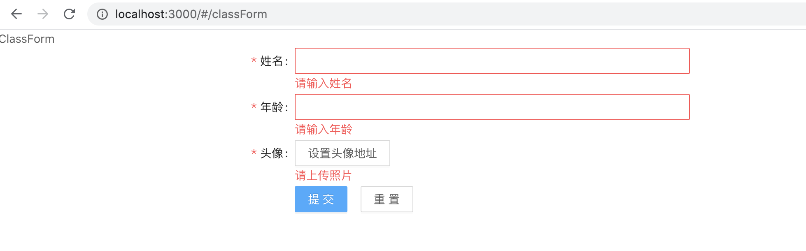
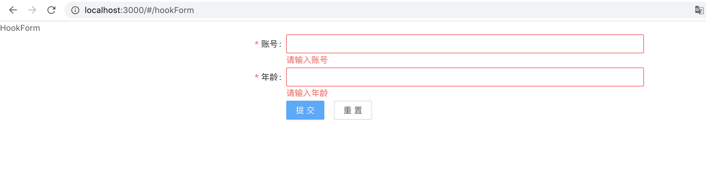
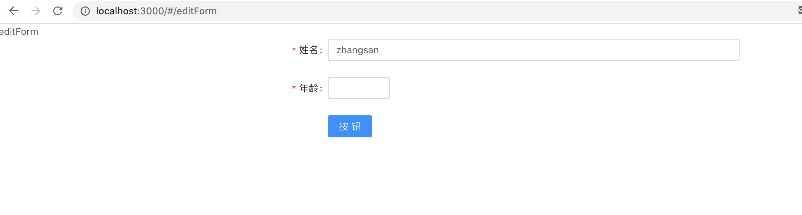

## This project was created by Create React App.

> It's using of testing antd-form(v4+).

### `yarn`
* 安装

### `yarn start`
* 启动

### `yarn build`
* 构建

### `yarn eject`
* 暴露webpack配置

## antd-form版本对比 - [官网描述](https://ant.design/docs/react/migration-v4-cn)
|       | 创建方法 |   区别   |
| :---- | :---- | :---- |
| antd-v3    |  Form.create()(ClassForm) | 包裹当前组件, 通过this.props.form获取对应方法 |
| antd-v4    |  const [form] = Form.useForm() | 通过form={form}创建form实例, 直接调用form.xxx方法 |


```javascript
// v3
class ClassForm extends Component {
    constructor(props) {
        super(props)
        this.state = {}
    }
}

export default Form.create()(ClassForm)

```

```javascript
// v4 弃用 Form.create方法

// class语法 通过createRef获取form方法
class ClassForm extends Component {
    constructor(props) {
        super(props)
        this.state = {}
        this.formRef = createRef()
    }

    render() {
        return(
            <div>
                <Form ref={this.formRef}>
                </Form>
            </div>
        )
    }
}

export default ClassForm

// hook语法 通过Form.useForm()
function HookForm(props) {
    const [form] = Form.useForm()
    return(
        <Form form={form}></Form>
    )
}
export default HookForm
```




